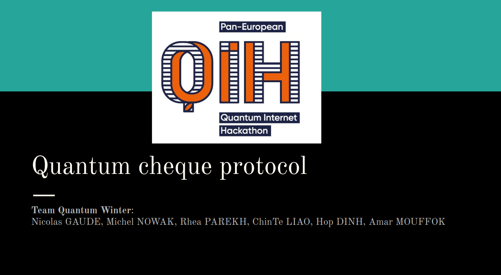
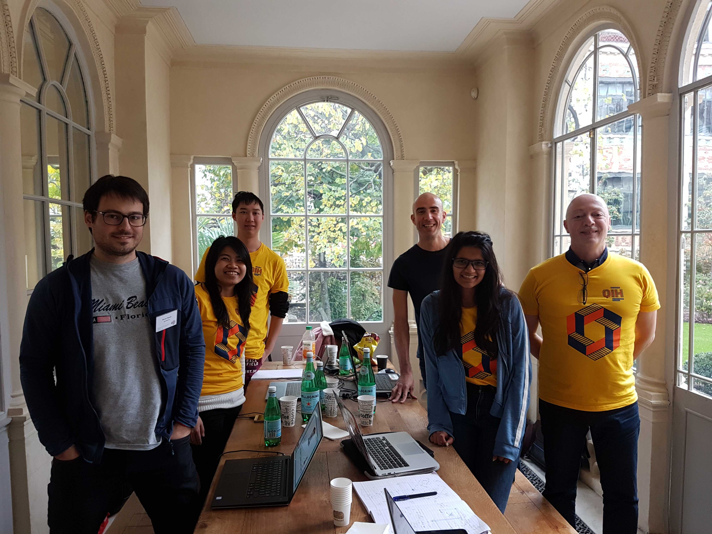

# quantumwinter



This Hackaton was a first [Pan-European-Hackaton](https://labs.ripe.net/Members/ulka_athale_1/take-part-in-pan-european-quantum-internet-hackathon) on the Quantum Technologies and more especially on the telecommunications domain.
Five countries have been implied;Netherlands, Switzerland, Italy, Ireland, Bosnia-Herzegovina and France.
It was not a competition but much more a moment of collaboration.

The team called "Quantum Winter" secured financial transactions by using the quantum cheques protocol which consists of several building blocks like SWAP test, BB84 QKD, quantum one way function etc.

The final project implemented is "Quantum-Cheque Protocol" that is present on the Quantum Protocol Zoo repository.
[Quantum Cheque Protocol](https://wiki.veriqloud.fr/index.php?title=Quantum_Cheque)

settings for simulaqron:
```
simulaqron reset && simulaqron stop && simulaqron set backend projectq && simulaqron set max-qubits 50 && simulaqron set recv-timeout 1000 && simulaqron start
```

to ensure swap_test is working :
```
python swap_test.py
```

to start a cheque protocol holder Alice send M dollars using a quantum M$ cheque to Charlie through bank Bob  :
```
python quantum_cheque.py
```



Team Quantum Winter:
- Nicolas GAUDE
- Michel NOWAK
- Rhea PAREKH
- ChinTe LIAO
- Hop DINH
- Amar MOUFFOK
