# Universal Blind Quantum Computation (UBQC)

The directory contains SimulaQron code for UBQC protocol for a partially quantum client (one who can prepare and send states) and single quantum server. The protocol is decomposed as an MBQC protocol for translation from the circuit model (that can be used by itself), on top of which is added the blinding of the input states, output and computation (based on the hiding of the computational angles and measurement outcomes) to derive a UBQC protocol. It includes a classical subroutine to translate a quantum circuit into measuremnent language (meaurement.py) and hence convert it according to flow construction devised by Elham Kashefi and Vincent Danos (flow.py), see ref[1]. The output is then interpreted using UBQC protocol on the client side to assign (delegate) a full-fledged secret quantum computation to an all powerful quantum server, see ref[2].


## Running

With Simulaqron 3.0.4:
Assume you have a working simulaqron environnement with qutip as backend.
Install also projectq to draw the circuit and networkx to draw the graph.
```bash
simulaqron reset && simulaqron set backend qutip && simulaqron start --nodes Alice,Bob
#Basic usage for running MBQC protocol:
python serverMBQC.py &
python clientMBQC.py
#see more options with --help:
python clientMBQC.py --help
#Basic usage for running UBQC protocol:
python serverUBQC.py &
python clientUBQC.py
#see more options with --help:
python clientUBQC.py --help
#You can also use one of the following scripts directly:
./runMBQC.sh #will run MBQC between Alice and Bob with basic option (choose a circuit at random in circuits/, draw it on Alice and draw the graph on Bob)
./runUBQC.sh #will run UBQC between Alice and Bob with basic option (choose a circuit at random in circuits/, draw it on Alice and draw the graph on Bob)
```
More examples can be found in script.sh.


With Older Simulaqron version:
```bash
git clone https://github.com/cgmcintyr/SimulaQron.git
cd SimulaQron
git checkout develop
export PYTHONPATH=$(pwd):$PYTHONPATH
export NETSIM=$(pwd)
./run/startAll.sh
cd examples/mbqc/
python server.py &
python client.py
```
## MBQC
This subroutine takes input as decribed in the JSON file in `circuits` directory. MBQC subroutine is composed of two functions, measurement.py and flow.py. The final output of the subroutine can be interpreted as follows:  

* E [i,j]: entangle qubits i and j using Controlled Phase (CZ gate). Lets denote by S the total set of such edges S={(i,j)}.
* M i 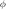 DX DZ: Give the measurement angle for qubit i in the
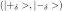 basis, where
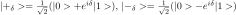,
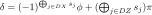,
 being the measurement outcome of qubit j and DX and DZ two lists of indexes.
* X j i: X correction to apply on qubit j depending on measurement outcome of qubit i. Lets denote by LX the total set of such indexes i.
* Z j i: Z correction to apply on qubit j depending on measurement outcome of qubit i. Lets denote by LZ the total set of such indexes i.

Finally the result of the computation on a input state  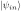 is given by:
 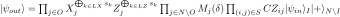, where 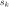 is the measurement outcome on qubit k, O is the set of output qubits, I the set of input qubits, N the total set of qubit encoded into the graph state defined by S.  

## Client/Server Design - UBQC protocol

By default, the client will load a random circuit from the `circuits` directory. This circuit describes a computation the client wishes to perform.

Firstly the client converts the circuit into their measurement equivalents (see `measurements.py`), using the following decomposition of H, CX and finally of the J operator as elementary operators, see ref[1]:
* 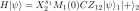
* 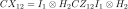
* 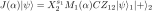

J is a usefull operator that satisfies
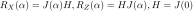.
In particular, J and CZ form a universal set for generating all unitaries, see ref[3].

Then the client converts these measurements into an MBQC flow (see flow.py) as decribed in the MBQC subroutines section.

The client then communicates with the server.

1. The clients sends the set S={(i,j)} of edges describing the graph to produce.
2. The client prepares 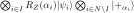 where 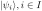
are the input states and where 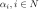
 are angles chosen at random in 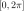 and used to hide the computational angles. The client sends them one by one to the server.  
3. The server entangles the qubits received as described by S.
4. For : 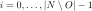
* the client chooses 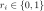 and asks the server to measure qubit i with  angle where 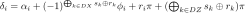. ( 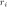 is used to hide the (next) measurement outcome).
* the server makes the measurement and sends back the measurement outcome 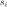 of qubit i.
5. The server sends back the non measured quantum states.

As so, the protocol does not implement a fully blind quantum computation as the graph is revealed to the server.


## Circuit JSON Documentation

We describe circuits to be encoded into MBQC format using a JSON file (see
examples in the `circuits` directory).


### Top Level Object

The file contains a single JSON object:

| Key   | Type                             | Descrption                    |
|-------|----------------------------------|-------------------------------|
| gates | list of gate objects (see below) | contains list of gate objects |


### Gate Objects

| Key    | Type                    | Descrption                                                                     |
|--------|-------------------------|--------------------------------------------------------------------------------|
| name   | string                  | name of gate to be created (does not have to be unique)                        |
| type   | string                  | "H", "Z", "X", "CZ", "CX", "J", "T", "R_Z" or "R_X".                           |
| qbits  | list of strings or ints | lists qubits the gate is applied to.                                            |
| angle  | int                     | Rotation angle btw 0 and 256, for R_Z, R_X and J only.                         |


## Authors

This example was created at the RIPE NCC Quantum Internet Hackathon 2018 by Team aMBiQuiCy.

The team members were:

* Andrey Hoursanov
* Anne Marin
* Christopher McIntyre
* Georg Harder
* Marc Ibrahim
* Shraddha Singh
* Yao Ma

## References:

[1] V. Danos, E. Kashefi, P. Panangaden, "The Measurement Calculus",
https://arxiv.org/pdf/0704.1263
[2] J.F. Fitzsimons, E. Kashefi, "Unconditionally Verifiable Blind Quantum Computation",
https://arxiv.org/abs/1203.5217
[3] V. Danos, E. Kashefi, P. Panangaden. "Parsimonious and robust realizations of unitary maps in the one-way model", Physical Review A, 72, 2005.
